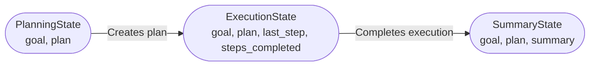

# Overview

This repository provides a template for building agentic AI projects using Python. Its goal is to offer a structured, best-practices starting point for developing modular, testable, and production-ready agentic systems. This framework is focused on LangChain/LangGraph, but is flexible enough for general-purpose agentic AI development.

## Key Features

- Simple Project Structure: Organized directories for source code (src/), tests (tests/), documentation (docs/), and CI/CD configuration (.github/).
- Editable Installation: Easily set up a development environment with pip editable mode.
- Built-in Testing: Comes with pytest configuration for unit testing.
- Example Planning Graph: Includes a sample planning graph implementation for agentic workflows.
- Security Best Practices: Guidance on managing secrets and credentials using environment variables or .env files.
- MIT Licensed: Permissive open-source license for commercial and personal use.
- Ready for CI/CD: Includes GitHub Actions workflow scaffolding for continuous integration

## Project structure

```
├── src/                    # project code
│   ├── agentic_core/      # core agentic framework
│   └── sample_agent/      # example agent implementation
├── tests/                 # unit tests
├── docs/                  # documentation
├── .github/               # CI configuration
├── .devcontainer/         # development container setup
├── docker-compose.yml     # Docker services configuration
├── Dockerfile            # Application container configuration
├── pyproject.toml        # Python project configuration
└── env.example           # Environment variables template
```

## Agentic Core State Flow

Below is a diagram of the main states involved in agentic workflows, as implemented in `agentic_core.state_schemas`. These states are optional and customizable, but serve as a reasonable jumping off point:



    PlanningState: Defines the agent's goal and an optional plan (list of actions).
    ExecutionState: Tracks the current plan, last executed step, and all completed steps.
    SummaryState: Holds the final goal, executed plan, and a summary after all steps are done.


## Getting started

### Local Development
1. Create a virtual environment and install the project in editable mode:
   ```bash
   python -m pip install -e .
   ```
2. Run tests:
   ```bash
   pytest -q
   ```

3. Import the default planning graph and iterate over steps:
    ```python
    from agentic_core.graphs.plan import plan_graph
    
    for step in plan_graph("Hello world"):
        print(step)
    ```

### Docker Development
1. Copy the environment file and configure your settings:
   ```bash
   cp env.example .env
   # Edit .env with your API keys and database credentials
   ```

2. Start the full stack with Docker Compose:
   ```bash
   docker compose up --build
   ```

   This will start:
   - PostgreSQL database with pgvector extension
   - Redis cache
   - The Python application

3. Access the application at `http://localhost:8000`

### Environment Variables
The following environment variables should be configured in your `.env` file:

- `POSTGRES_USER`: Database username (default: postgres)
- `POSTGRES_PASSWORD`: Database password (default: password)
- `POSTGRES_DB`: Database name (default: mydb)
- `OPENAI_API_KEY`: Your OpenAI API key
- `CLAUDE_API_KEY`: Your Anthropic Claude API key
- `LANGCHAIN_API_KEY`: Your LangChain API key
- `LANGCHAIN_TRACING_V2`: Enable LangChain tracing (default: true)
- `LANGCHAIN_PROJECT`: LangChain project name (default: agentic-template)

### Troubleshooting

- `LANGCHAIN_PROJECT`: LangChain project name (default: agentic-template)

### Troubleshooting

**Docker Build Issues:**
- If you encounter SSL certificate errors during Docker build, the Dockerfile includes trusted-host flags for PyPI
- For corporate networks, you may need to configure Docker to use your proxy settings

**Database Connection:**
- Ensure the PostgreSQL service is healthy before the app starts (handled by `depends_on` in docker-compose.yml)
- Check that your `.env` file has correct database credentials

**Missing Dependencies:**
- If you get import errors, ensure all dependencies are installed: `pip install -e .`
- For development dependencies: `pip install -e ".[dev]"`

## Security guidelines
Secrets should never be committed to the repository. Use environment variables
or a `.env` file excluded from version control for credentials.

## License
This project is licensed under the MIT License. See [LICENSE](LICENSE) for
more information.
